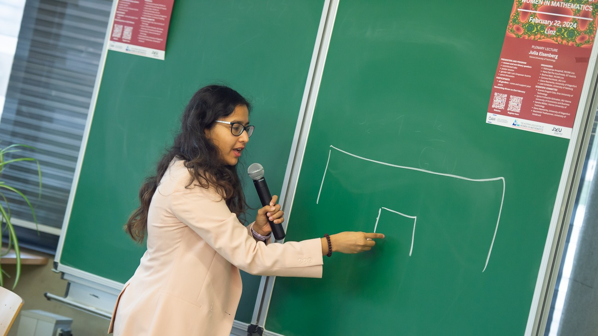

## Teaching

### Seminars
- I am currently organizing a reading seminar titled *"Elliptic curve cryptography in a post quantum paradigm"* at the University of Cantabria. We meet every week on Wednesdays. 

### Supervision of theses
-  Bachelor's thesis by Javier González Colsa, "The BB84 Protocol: Quantum Foundations and Computational Applications in Secure Communication". Ongoing, co-supervising with Domingo Gómez Pérez at the University of Cantabria.
-  Bachelor's thesis by Sergio Chávez Camarero. Ongoing, co-supervising with Ana Isabel Gómez Pérez at the Universidad Rey Juan Carlos, Madrid.
-  Bachelor's thesis by Alberto García Sroda. Ongoing, co-supervising with Ana Isabel Gómez Pérez at the Universidad Rey Juan Carlos, Madrid.

### Teaching Assistant
- I was a teaching assistant at Johannes Kepler University, Linz for the following courses. The job included creating problem sets for undergraduate students and teaching weekly **exercise** classes. 
- Past courses:
    - October 2022 - February 2023, _Mathematics for AI_ in **English**.
    - March 2021 - September 2021, _Mathematics for Physics II (Linear Algebra)_ in **German**.
    - October 2020 - February 2021, _Mathematics for Physics I (Analysis of one variable)_ in **German**.

## Organization

- (Feb 2024) Chair organizer of the [**Fourth Austrian Day of Women in Mathematics (ADWiM)**](https://sites.google.com/view/adwim2024/home){target="_blank"} held in Linz from 21st - 22nd February 2024. The event was a huge success, with around 90 registered participants. 
- (Feb 2023) Co-organizer of the [**Third Austrian Day of Women in Mathematics (ADWiM)**](https://sites.google.com/view/adwim-2023/home){target="_blank"}.

- Executive committee member of [**Austrian Association of Women in Mathematics (A2WiM)**](https://www.a2wim.net/about){target="_blank"}.
    - Co-organizer of the [virtual **tea time** meetings](https://sites.google.com/view/a2wim/our-activities/projects#h.soyo1ot3whhb).  
    - Main organizer of the film screening _Secrets of the Surface_ on May 12th, 2022. 

- Core team member of [**Amicable Scientists**](https://amicablescientists.org){target="_blank"}.
    - (Feb 2019) Gave a talk on _Mathematics and other career paths_ to 11th Grade students at schools in Belpahar, India as a part of outreach. 
    - (December 2018) Gave a talk on _Fermat’s last theorem, elliptic curves and cryptography_ to master's students in mathematics at St. Joseph’s College, Bangalore.

## Other

- I use [MyPaintEdSlides](https://steffenpl.github.io/blog/posts/mypaintedslides/){target="_blank"} for my presentations.

---

>  Chair organizer for the <a href="https://sites.google.com/view/adwim2024/home" target="_blank">4th Austrian Day of Women in Mathematics</a> in Linz, Austria.
