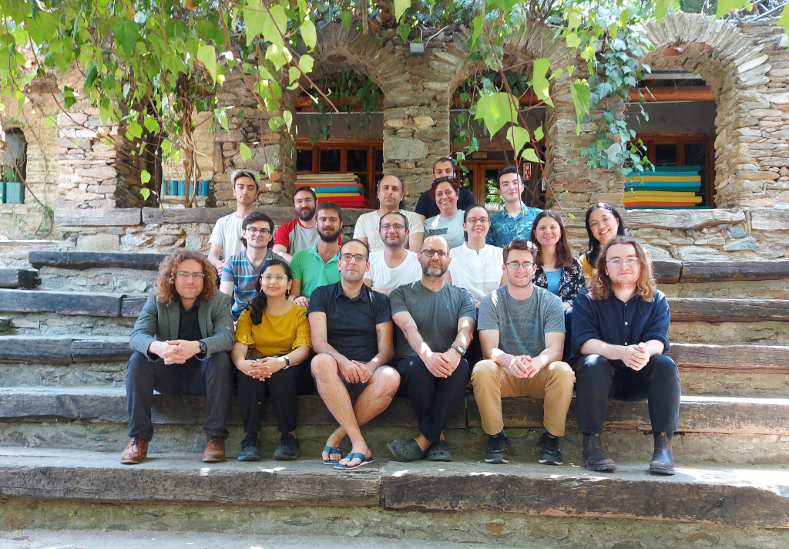

### Former and current positions

|       |                  |
| ----- | ---------------- |
| Feb 2023 - Current | Postdoc Research scientist at RICAM, Linz. |
| 2019 - Jan 2023 | PhD Research scientist at RICAM, Linz. |

### Biographical sketch

|       |                  |           |
| ----- | ---------------- | --------- |
| 2019 - 2023 | PhD in Mathematics | JKU-Linz, Austria |
| 2015 - 2018 | MSc in Mathematics International (Specialization: Algebra and Number theory) | TU Kaiserslautern, Germany |
| 2012 - 2015 | BSc in Physics, Chemistry, Mathematics (Triple Major) | St. Joseph's College, Bangalore, India |

<!--- You can find a detailed CV <a href="{{ '/assets/Anupindi_CV.pdf' | url }}" target="_blank">here</a> --->

---

> Group photo with the participants of <a href="https://nesinkoyleri.org/en/events/2022-summer-school-in-theory-of-partitions/" target="_blank">Workshop on Integer Partitions</a> at the Nesin Mathematics Village, Turkey.
